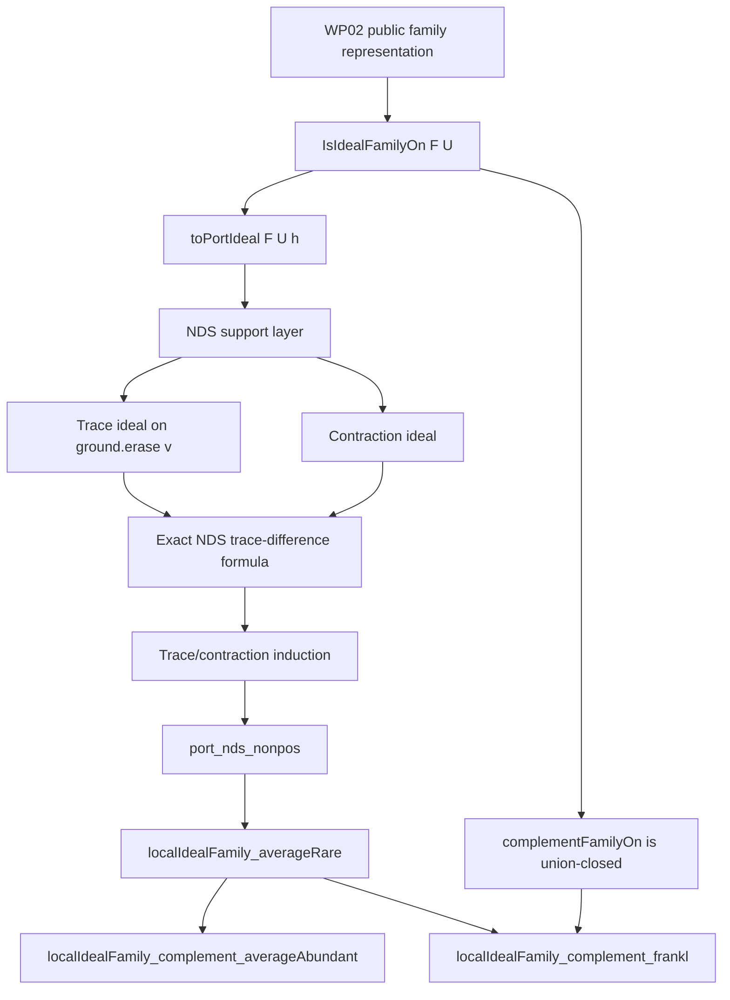

# Dependency DAG

## Diagram



The same diagram is available as a standalone Mermaid artifact:

```text
artifacts/figures/ideal_family_bridge_dag.mmd
```

## Dependency Table

| Node | Depends on | Discharge condition |
|---|---|---|
| Representation bridge | WP02 `Family alpha` substrate | Lean imports compile |
| Port ideal | `IsIdealFamilyOn F U` | Carrier, degree, and NDS equivalences checked |
| NDS support | Ported ideal-family definitions | Summation and base lemmas checked |
| Trace ideal | Chosen ground vertex | Trace is an ideal on smaller ground |
| Contraction ideal | Singleton branch | Contraction carrier and NDS bounds checked |
| Trace difference | Trace plus contraction | Exact arithmetic formula checked |
| Induction | Smaller ground trace/contraction | `port_nds_nonpos` checked |
| Average rarity | NDS nonpositivity | Local bridge theorem checked |
| Complement duality | Average rarity plus complement family | Frankl-facing theorem checked |

## External Dependency Boundary

The upstream ideal-family repository is not a dependency in this DAG. It is a
source-comparison and provenance artifact only. The checked path is local to
MATHCERT.

